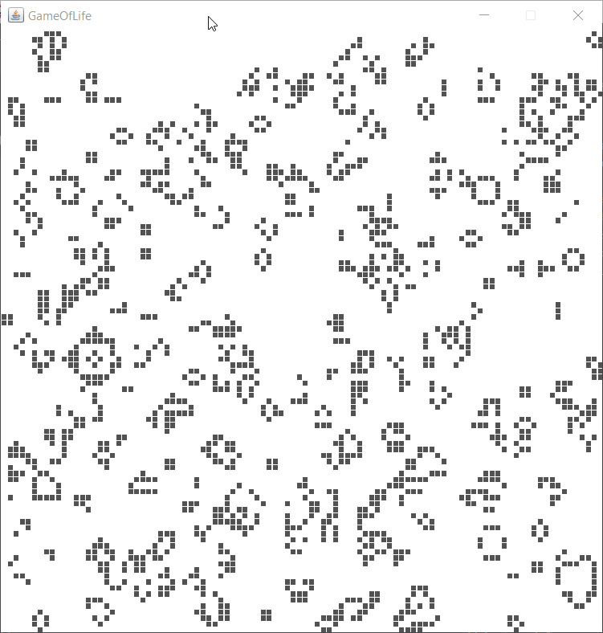

# Game of Life

## Table of contents
* [General info](#general-info)
* [Usage](#usage)

## General info
This project includes an implementation of the [game of life](https://en.wikipedia.org/wiki/Conway%27s_Game_of_Life) on the basis of an event simulation engine.
	
## Usage
### Instruction
```java
    public static void main(String[] args){
        SimManager simMgr = new SimManager( ① , ② );
        simMgr.setIterations( ③ );
        simMgr.startSimulation();
    }
```
* ① - size of board (x)
* ② - size of board (y)
* ③ - number of iterations


### Sample iteration view

